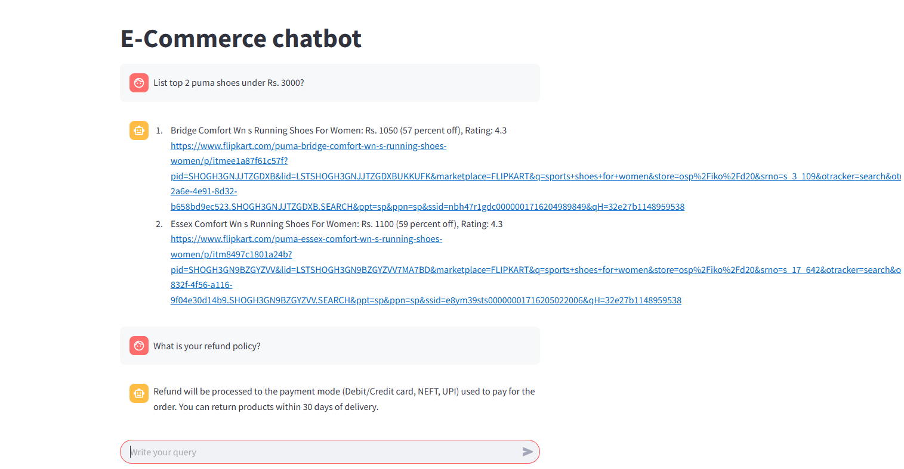

# E-Commerce Chatbot  
### GenAI RAG Project using LLaMA 3.3 & GROQ API

This project is a proof-of-concept (PoC) for an intelligent, retrieval-augmented chatbot tailored for e-commerce platforms. It provides context-aware, real-time responses by identifying user intent and integrating with a live product database. Powered by LLaMA 3.3 via GROQ.

## Repository Contents

| File / Folder          | Description                                                   |
|-----------------|---------------------------------------------------------------|
| `main.py`          | Main Streamlit UI and chatbot logic |
| `router.py` | Semantic Router implementation for intent classification |
| `evaluate_router.py` | Script to evaluate and measure intent classification accuracy |
| `*.ipynb` | Jupyter Notebooks for scraping product data from e-commerce websites |

## Supported Intents

The chatbot supports the following types of user queries:

- **FAQ**  
  Answers questions related to platform policies or general info.  
  Example:  
  `Is online payment available?`

- **SQL Query**  
  Dynamically fetches and filters product data from the database.  
  Example:  
  `Show me all Nike shoes below Rs. 3000.`

- **Small Talk**  
  Handles casual or conversational prompts.  
  Example:  
  `How are you?`

## Screenshots

**Product Query Result**  


**Architecture Diagram**  


## Setup & Execution

```bash
pip install -r requirements.txt
```

Create a `.env` file in the root directory with your GROQ credentials:

```env
GROQ_MODEL=llama-3.3-70b-versatile
GROQ_API_KEY=your_groq_api_key_here
```

Run the Streamlit app:

```bash
streamlit run main.py
```

## Intent Classification Evaluation
This project includes a dedicated script to validate the accuracy of the Semantic Router. By curating diverse training utterances, the router dynamically routes queries to the correct LLM chain without relying on hardcoded `if/else` statements.

Run the evaluation suite:
```bash
python evaluate_router.py
```
*Current Accuracy: ~83% across out-of-sample Product, FAQ, and Conversational test cases.*

## Tech Stack

- LLaMA 3.3 via GROQ API  
- Semantic Router (HuggingFace Embeddings)
- Retrieval-Augmented Generation (RAG)  
- Python & Streamlit (Web Interface)  
- SQLite & ChromaDB
- Web Scraping for product data
